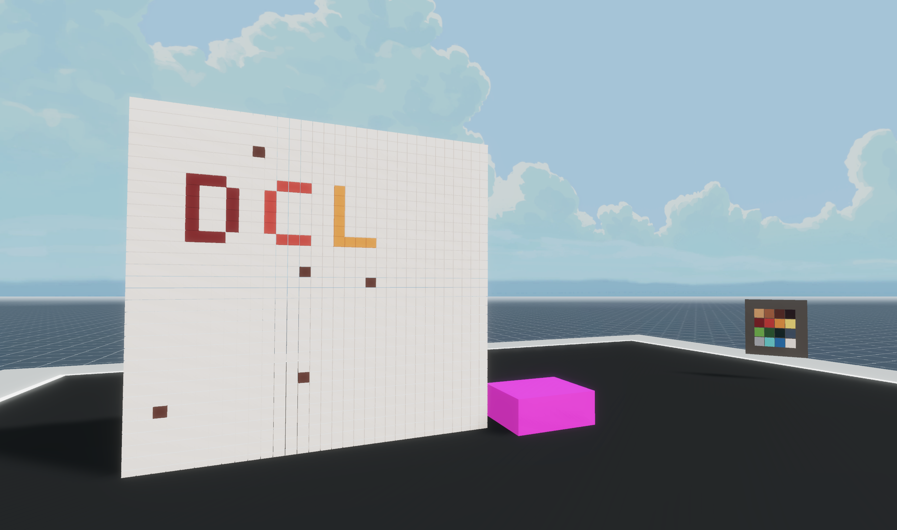

# Pixel Mural

_A screenshot of the mural-example-scene running in preview._

This scene lets you paint a mural by coloring one pixel at a time in a grid of 32 x 32 pixels. You can then mint the resulting mural as an NFT on [PixelChain](https://pixelchain.art/).



This scene shows you:

- How to interact with a smart contract to call its functions (Pixelchain's contract, in this case)
- How to use the messagebus to sync changes with other players
- How to encapsule logic and properties into game objects
- How to display a UI with buttons and input fields
- How to use trigger areas to delay the rendering of entities till a player enters an area
- How to change the materials of a primitive shape

## Try it out

**Install the CLI**

Download and install the Decentraland CLI by running the following command:

```bash
npm i -g decentraland
```

**Previewing the scene**

Download this example and navigate to its directory, then run:

```
$:  dcl start
```

Any dependencies are installed and then the CLI opens the scene in a new browser tab.

Paste the following to the end of the URL in the browser window:

`&ENABLE_WEB3`
For example, if the URL is http://127.0.0.1:8000?position=0%2C0&SCENE_DEBUG_PANEL, make it http://127.0.0.1:8000?position=0%2C0&SCENE_DEBUG_PANEL&ENABLE_WEB3

> Note: The mural itself may take some time to load before you can see it.

> Note: When running a preview of a scene that uses one of the ethereum libraries, you must have Metamask or Dapper open and you must add this string.

**Scene Usage**

Approach the center of the scene for the wall and the pallette to load.

On the different colors of the pallette press E to pick a color, then click on the tiles of the mural to paint them that color. Other players in the scene will also see the mural change.

You can also press F on one of the colors of the swatch to open a UI where you can set a different Hex color. Pixelchain NFTs can only contain up to 12 different colors, but you can pick which colors. So you can change any of the colors and this will be also synced w other players.


When you're happy with your creation, click on the pink cube next to the mural and it will open a UI where you can give your work a name and mint it as a PixelChain NFT.


Learn more about how to build your own scenes in our [documentation](https://docs.decentraland.org/) site.

If something doesn’t work, please [file an issue](https://github.com/decentraland-scenes/Awesome-Repository/issues/new).

## Copyright info

This scene is protected with a standard Apache 2 licence. See the terms and conditions in the [LICENSE](/LICENSE) file.
